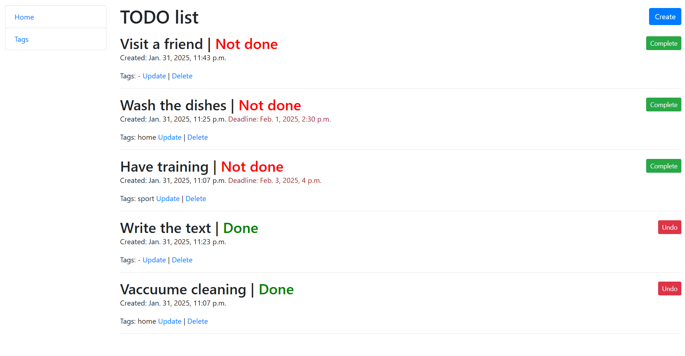

# TODO list

TODO list is a Django-based web application designed to optimize and effectively manage tasks.

## Installation

Python3 must be already installed

```shell
git clone https://github.com/mykola-tarasenko/mate-to-do-list
cd mate-to-do-list
python3 -m venv venv
source venv/bin/activate
pip install -r requirements.txt
python manage.py runserver # starts Django Server
```

## Features

* Create, update, delete, and complete tasks and tags.
* Task ordering. Tasks are ordered from not done to done and from the newest to the oldest one.
* Sidebar navigation.
* Tasks completion toggle button.

## Demo


